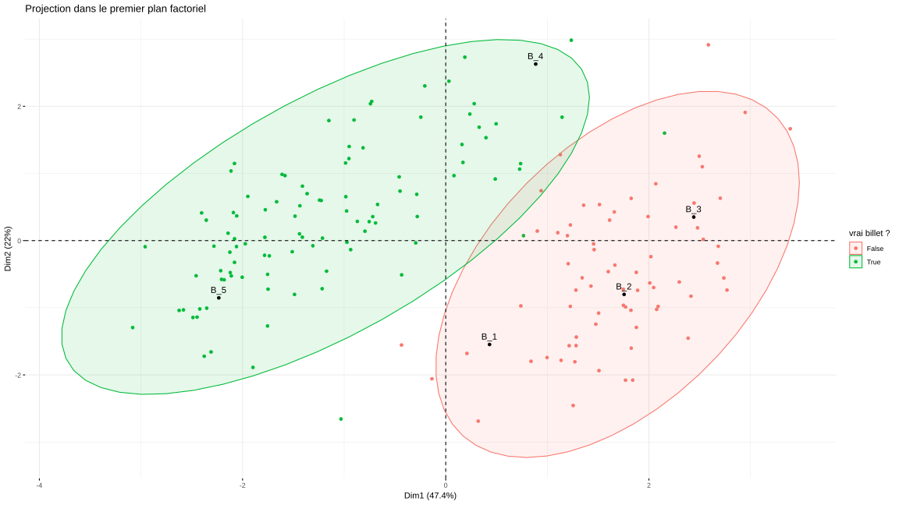

*Ce projet a été réalisé dans le cadre de la formation [Data Analyst](https://openclassrooms.com/fr/paths/65-data-analyst), sur la plateforme OpenClassrooms.*

### Introduction

Dans le cadre de ce projet, j'ai créé un programme capable de détecter si un billet est faux à partir de ses dimensions.

J'ai exploré les données d'apprentissage fournies contenant les dimensions et les labels de 170 billets fictifs. J'ai analysé les corrélations entre les variables pour déterminer les plus discriminantes en effectuant des analyses bivariées et une ACP.
J'ai ensuite comparé différents algorithmes de classifications non supervisées : le CAH, les K-means et l'HCP. Les données étant labellisées, j'ai également effectué une classification supervisée. J'ai divisé le jeu donné en train/test pour tester l'efficacité d'un modèle de régression logistique.

J'ai implémenté un programme utilisant ce modèle et calculant automatiquement la probabilité d'authenticité d'une liste de billets. Il affiche sous forme de graphique les billets testés parmi les données d'apprentissage (sur le premier plan factoriel) afin d'offrir une intuition visuelle de la classification.

<br />

:arrow_forward: [Voir ma présentation des résultats](présentation.pdf)

:notebook: [Notebook](https://htmlpreview.github.io/?https://github.com/CharlieBrugvin/detection-faux-billets-en-R/blob/master/2.notebook.html)

<br />


### Organisation des sources

3 dossiers :
- `1.donnees` : les données initiales du projet
- `3.notebook_figures` : graphiques et données générées lors de l'étude
- `4.programme_detection` : code source du programme de détection
    
1 R notebook :
- `2.notebook.Rmd`

### Programme de détection de faux billets

Pour le lancer depuis le terminal :
```
cd 4.programme_detection
```
puis lancer le script R avec comme argument le fichier contenant les billets à tester
```
Rscript detect_faux_billets.R 'billets_a_tester.csv'
```

Cela affichera pour chaque billet sa probabilité d'être vrai. Un fichier acp.svg sera automatiquement enregistré, affichant le billets à tester parmis les données d'apprentissage sur le premier plan factoriel.

Exemple : 



